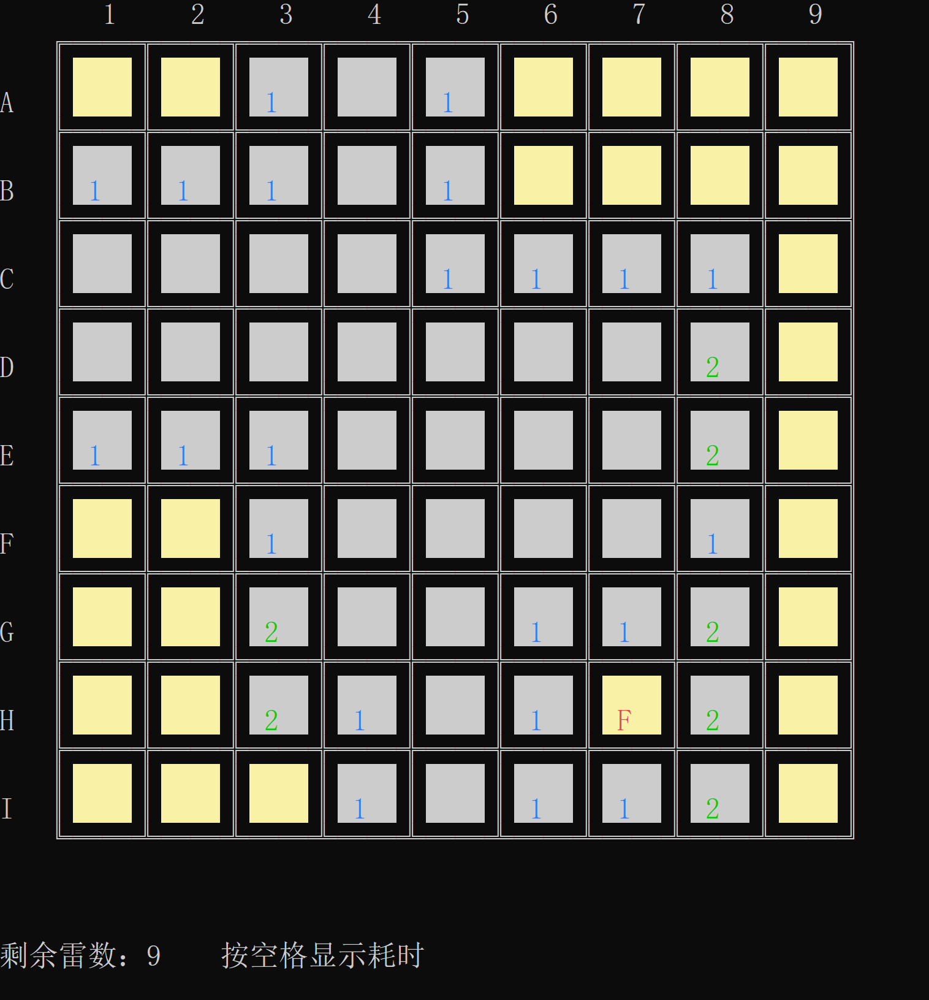

# 扫雷控制台游戏 | C++ 课程项目

## 🎮 项目简介
这是一个基于 C++ 开发的经典扫雷控制台游戏，作为课程大作业完成。
项目实现了扫雷的核心逻辑、随机雷区生成、安全展开算法、标记与插旗功能，同时封装了控制台绘图工具，实现了可视化游戏界面与交互。

## 🛠️ 运行环境
- 开发工具：Visual Studio 2022
- 语言标准：C++11 及以上
- 运行依赖：Windows 系统控制台（自带API，无需额外安装依赖）

## 🚀 编译运行步骤
1.  **下载代码**：将本仓库代码下载/克隆到本地
2.  **打开项目**：使用 Visual Studio 2022 打开 `90-b2.vcxproj` 项目文件
3.  **编译生成**：点击菜单栏「生成」→「生成解决方案」
4.  **运行程序**：编译完成后，直接点击「本地Windows调试器」运行即可启动游戏

## ✨ 核心功能亮点
- 实现了扫雷核心算法：随机雷区生成、安全区域递归展开、插旗标记功能
- 支持自定义难度模式（初级/中级/高级），可调整棋盘大小与地雷数量
- 封装了控制台绘图工具，实现了棋盘渲染、光标移动、点击交互的可视化界面
- 包含游戏状态管理（胜利/失败判断、步数统计、计时功能）
- 设计了交互菜单，支持游戏开始、难度选择、重新开始等操作

## 📸 运行截图
